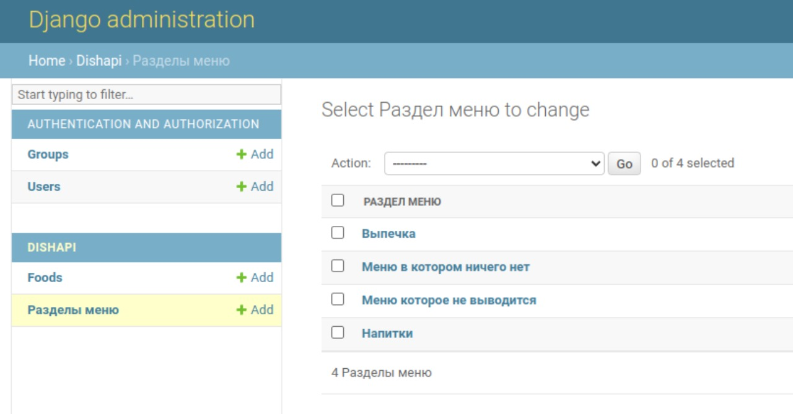
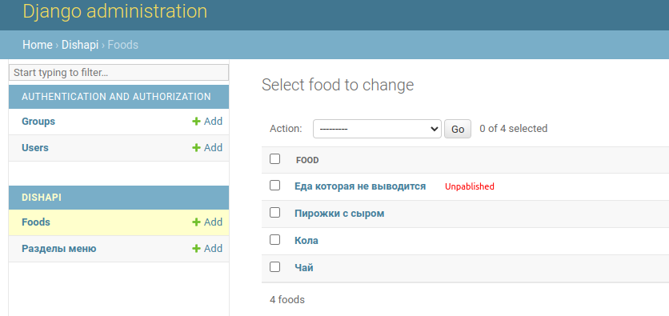
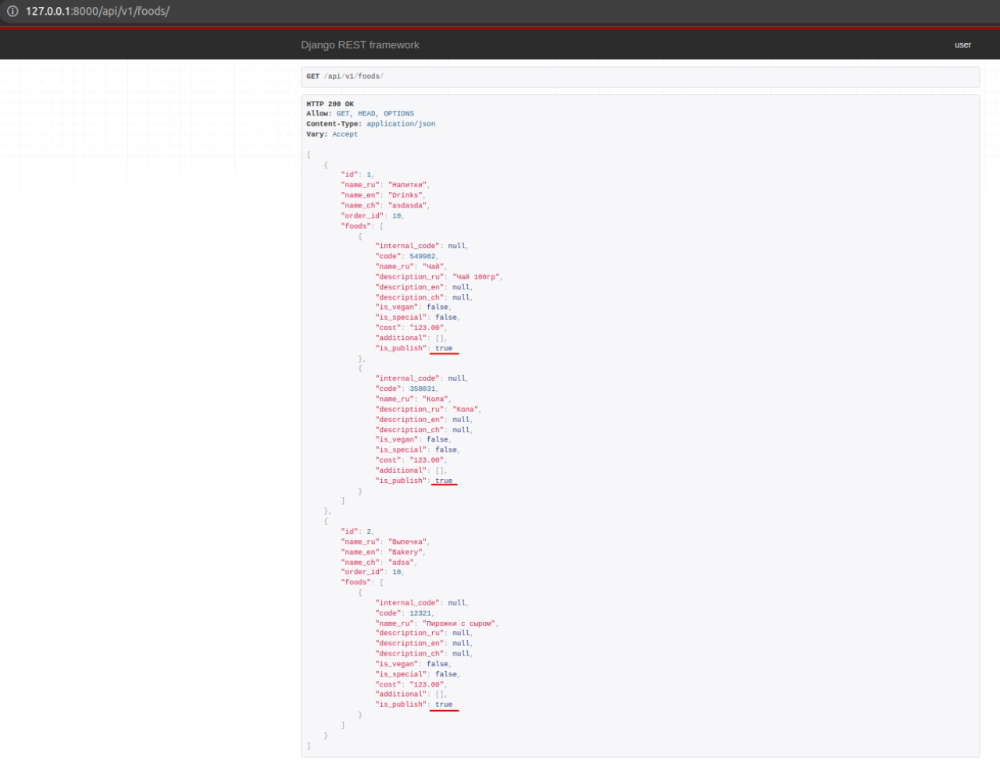

# CodingTeam

### Endpoint with Food filtered by publishing

Made whole project to test and make sure that all works fine
Viewset is located in ./Dishes/DishAPI/views

### Dataset:

Categories:

Food:

Result:
We are fetching only categories which have published food, and all presented food is published too. 
